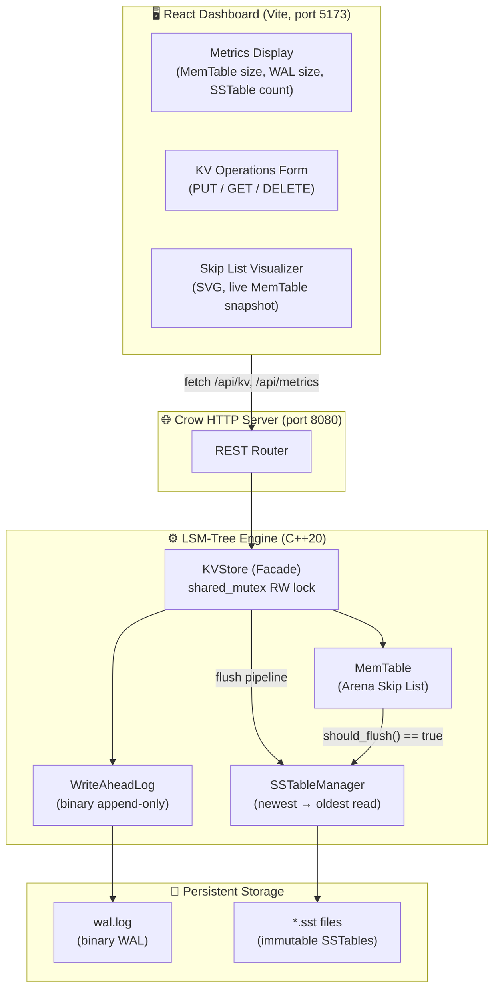

# 🗄️ KVault-DB — LSM-Tree Key-Value Store

> A production-grade, single-node Key-Value Store built from scratch in **C++20**, implementing the full Log-Structured Merge-Tree (LSM-Tree) storage engine with a real-time **React** visualization dashboard. Every layer — from probabilistic data structures to binary disk serialization — is implemented without third-party storage libraries.

[](https://isocpp.org/)
[](https://cmake.org/)
[](https://react.dev/)
[](https://google.github.io/googletest/)
[](https://ninja-build.org/)
[](LICENSE)

---


---

## 🧠 Motivation

Competitive programming develops strong algorithmic intuition — Skip Lists, balanced trees, hashing — but leaves a gap: how do these structures behave under real-world constraints like **crash recovery**, **byte-level I/O**, **memory ownership**, and **concurrent access**?

KVault-DB is the answer to that question. It systematically applies the algorithms from competitive programming to solve the engineering problems that define production database internals: ordered in-memory storage, durability via write-ahead logging, space-efficient disk layout, and probabilistic false-positive filtering.

The architecture mirrors the engine that powers **LevelDB**, **RocksDB**, and **Apache Cassandra**.

---

## ⚙️ Core Systems Engineering Highlights

### 🧩 Arena-Allocated Skip List (MemTable)

The in-memory write buffer is a custom **probabilistic Skip List** ($p = 0.5$, `kMaxLevel = 16`) supporting $O(\log n)$ expected insert, search, and delete.

**The critical design decision** was the memory ownership model. A naive implementation using recursive `std::unique_ptr<Node>` chains has two fatal flaws:
1. **Double-free UB**: multiple forward pointers at different levels point to the same node — violating `unique_ptr`'s exclusive-ownership invariant.
2. **Stack overflow on destruction**: a million-node chain causes a million-deep recursive destructor call stack.

The solution is an **Arena Allocation** model:

```
 head_ (unique_ptr<Node>)      arena_ (vector<unique_ptr<Node>>)
 ┌────────────────┐             ┌──────────────────────────────┐
 │ forward[0] ────┼──► Node A   │ [0] unique_ptr → Node A      │
 │ forward[1] ────┼──► Node C   │ [1] unique_ptr → Node B      │
 │ forward[2] ────┼──► ...      │ [2] unique_ptr → Node C      │
 └────────────────┘             └──────────────────────────────┘
                                  ▲  OWNS all nodes (bulk O(n) cleanup)
                                  │  forward[] are NON-OWNING raw Node*
```

The `arena_` vector holds **exclusive ownership** of every node via `unique_ptr`. The `forward[]` arrays inside each node are **non-owning raw pointers** used solely for traversal. When the SkipList is destroyed, the `vector` destructor frees every node in one flat, iterative pass — **zero recursion, zero stack pressure**.

> **Key insight:** When `vector<unique_ptr>` reallocates (grows), the `unique_ptr` objects are *moved* to new memory, but the underlying heap addresses (`Node*`) do not change. All raw pointers in `forward[]` remain valid after any reallocation.

**Tombstone semantics:** Deletes are implemented as blind `O(1)` writes of a sentinel value (`"\x7F__KVAULT_TOMBSTONE__\x7F"`), never physical removals. This is architecturally necessary — the key may exist in an older on-disk SSTable. The tombstone logically vetoes it during reads without any disk I/O.

---

### 📝 Binary Write-Ahead Log (WAL) with CRC32 Integrity

Every mutation (`PUT` / `DELETE`) is durably serialized to a binary append-only log **before** being applied to the MemTable, guaranteeing crash recovery.

**Binary record format (per entry):**

```
┌──────────┬────────────┬────────────┬────────────┬────────────┬─────────────────────────┐
│ CRC32    │ RecordType │ key_len    │ value_len  │  key data  │  value data             │
│ (4 bytes)│ (1 byte)   │ (4 bytes)  │ (4 bytes)  │ (variable) │  (variable)             │
└──────────┴────────────┴────────────┴────────────┴────────────┴─────────────────────────┘
```

**CRC32 is computed at compile time** using a `constexpr` lookup table (polynomial `0xEDB88320`), eliminating runtime table initialization overhead. On WAL replay (crash recovery), the CRC is recomputed and compared; a mismatch causes replay to **stop at the corruption boundary** — preventing partial-write poison from entering the engine.

---

### 💾 SSTable Writer — Sequential Disk Layout

When the MemTable exceeds its configured flush threshold, it is atomically snapshotted, serialized to an immutable **Sorted String Table (SSTable)** file, and cleared. The binary file layout:

```
┌─────────────────────────────────────────────────────────────────────┐
│  DATA BLOCK      │  SPARSE INDEX BLOCK  │  BLOOM FILTER  │  FOOTER  │
│  (sorted KV pairs│  (every Nth key +    │  (serialized   │ (offsets │
│   with lengths)  │   byte offset)       │   bitset)      │  + magic)│
└─────────────────────────────────────────────────────────────────────┘
```

The **footer** is verified at compile time with a `static_assert` on its byte size — a zero-cost contract that prevents accidental layout drift from breaking the reader's seek calculation. `fsync()` is called after the write to flush OS page cache to durable storage before the WAL is truncated.

---

### 🔍 Read-Path Optimization: Double-Hashed Bloom Filters

To avoid expensive disk reads for non-existent keys, every SSTable carries an in-memory **Bloom Filter**. Rather than requiring $k$ independent hash functions, we use the **double-hashing technique** (Kirsch-Mitzenmacher optimization):

$$h_i(x) = h_1(x) + i \cdot h_2(x) \pmod{m}, \quad i = 0, 1, \ldots, k-1$$

Two base hashes (**FNV-1a** + a **Murmur3-style mix**) generate all $k$ probe positions, eliminating the cost of $k$ separate hash computations. The filter is serialized directly into the SSTable file and memory-mapped on startup.

**SSTable Lookup Path:**

```
GET("key")
  │
  ├─► MemTable (O(log n) Skip List search)
  │      ├── Found live value → return it
  │      └── Found tombstone  → return nullopt (no disk I/O)
  │
  └─► SSTableManager (newest → oldest)
         │
         ├─► Bloom Filter check (O(k) bit reads, k=7 by default)
         │      └── Negative → skip this SSTable (no disk I/O)
         │
         └─► Sparse Index binary search → seek → linear scan → return
```

The **sparse index** stores one entry per $N$ keys with their byte offsets. An `upper_bound` binary search locates the correct disk block, then a short linear scan finds the exact key. This trades index memory for I/O precision.

---

### ✅ Test Coverage: 74/74 in Under 1.6 Seconds

| Test Suite | Tests | What It Covers |
|---|---|---|
| `SkipListTest` | 16 | CRUD, iteration, upsert, remove, 10K stress |
| `MemTableTest` | 22 | Tombstones, byte tracking, snapshot order |
| `WALTest` | 18 | Replay, CRC corruption, truncation, sync modes |
| `SSTableTest` | 14 | Bloom FP rates, round-trip, corrupted footer |
| `KVStoreTest` | 4 | WAL recovery, SSTable cascade, flush pipeline |
| **Total** | **74** | **Zero warnings (`-Wall -Wextra -Wpedantic`)** |

---

## 🏗️ Full-Stack Architecture

### Request Flow



### PUT Write Path

```
PUT("k", "v")
  1. Acquire exclusive lock (unique_lock<shared_mutex>)
  2. WAL::append({PUT, "k", "v"})  ← binary write + optional fsync
  3. MemTable::put("k", "v")       ← O(log n) Skip List insert
  4. if (memtable.should_flush())
       → snapshot() → SSTableWriter::write() → SSTableManager::register()
       → WAL::truncate() → MemTable::clear()
  5. Release lock
```

### GET Read Path

```
GET("k")
  1. Acquire shared lock (shared_lock<shared_mutex>)
  2. MemTable::get("k")
       → found live value  → return immediately
       → found tombstone   → return nullopt (key definitively deleted)
       → not found         → fall through to disk
  3. SSTableManager: iterate newest → oldest
       → BloomFilter::might_contain("k") == false → skip (no I/O)
       → Binary search sparse index → seek → scan → return if found
  4. Return nullopt if exhausted all SSTables
```

---

## 📁 Project Structure

```
KVault-DB/
│
├── CMakeLists.txt                    # Root CMake (C++20, FetchContent, Ninja)
├── README.md
│
├── include/kvault/                   # ══ PUBLIC HEADERS ══
│   ├── kvstore.hpp                   # Top-level engine facade
│   ├── memtable.hpp                  # MemTable with byte tracking & tombstones
│   ├── skiplist.hpp                  # Arena-allocated probabilistic Skip List
│   ├── wal.hpp                       # Binary Write-Ahead Log interface
│   ├── sstable_writer.hpp            # SSTable serialization (flush path)
│   ├── sstable_reader.hpp            # SSTable deserialization (read path)
│   ├── sstable_manager.hpp           # Multi-SSTable read orchestration
│   ├── bloom_filter.hpp              # Double-hashed Bloom Filter
│   ├── api_routes.hpp                # Crow HTTP route declarations
│   ├── config.hpp                    # Tunable EngineConfig parameters
│   └── types.hpp                     # Key, Value, KVRecord, RecordType
│
├── src/                              # ══ IMPLEMENTATION ══
│   ├── kvstore.cpp
│   ├── memtable.cpp
│   ├── skiplist.cpp
│   ├── wal.cpp
│   ├── sstable_writer.cpp
│   ├── sstable_reader.cpp
│   ├── sstable_manager.cpp
│   ├── bloom_filter.cpp
│   ├── api_routes.cpp                # Crow JSON handlers + CORS
│   └── main.cpp                      # Server entry point (port 8080)
│
├── tests/                            # ══ GOOGLETEST SUITE ══
│   ├── CMakeLists.txt
│   ├── test_skiplist.cpp             # 16 tests
│   ├── test_memtable.cpp             # 22 tests
│   ├── test_wal.cpp                  # 18 tests
│   ├── test_sstable.cpp              # 14 tests
│   └── test_kvstore_integration.cpp  # 4 end-to-end tests
│
└── dashboard/                        # ══ REACT DASHBOARD ══
    ├── package.json
    ├── vite.config.js                # Proxy /api → localhost:8080
    ├── index.html
    └── src/
        ├── App.jsx                   # Root layout
        ├── index.css                 # Glassmorphism design system
        ├── hooks/
        │   ├── useKVStore.js         # PUT/GET/DELETE fetch hook
        │   └── useMetrics.js         # 2-second polling hook
        └── components/
            ├── KVForm.jsx            # Operation panel + history
            ├── MetricsDashboard.jsx  # Live metric cards
            └── SkipListVisualizer.jsx# SVG Skip List diagram
```

---

## 🚀 Quick Start

### Prerequisites

| Tool | Version | Notes |
|---|---|---|
| GCC / Clang | ≥ 13 (GCC) | C++20 required |
| CMake | ≥ 3.20 | |
| Ninja | any | Recommended generator |
| Node.js | ≥ 18 | For the React dashboard |

> **Windows (MSYS2/UCRT64):** All commands work in the UCRT64 shell. CMake will auto-download Crow, ASIO, and GoogleTest via `FetchContent`.

---

### 1. Build the C++ Backend

```bash
# Clone
git clone https://github.com/KHU5HWANT/kvault-DB.git
cd kvault-DB

# Configure (downloads dependencies automatically)
cmake -B build -G Ninja -DCMAKE_BUILD_TYPE=Release

# Compile
cmake --build build --parallel
```

---

### 2. Run the Test Suite

```bash
cd build
ctest --output-on-failure
```

Expected output:
```
100% tests passed, 0 tests failed out of 74
Total Test time (real) =   1.58 sec
```

---

### 3. Start the Engine Server

```bash
# From the project root:
./build/kvault_server.exe      # Windows
# OR
./build/kvault_server          # Linux/macOS
```

```
Starting KVault Engine...
KVault initialized. Recovered WAL size: 0 bytes. Active SSTables: 0
Starting HTTP API on port 8080...
[INFO] Crow server running at http://0.0.0.0:8080 (16 threads)
```

---

### 4. Start the React Dashboard

```bash
cd dashboard
npm install
npm run dev
```

Open **http://localhost:5173** — the dashboard connects automatically and begins polling engine metrics every 2 seconds.

---

### 5. Test the REST API Directly

```bash
# PUT a key
curl -X POST http://localhost:8080/api/kv \
     -H "Content-Type: application/json" \
     -d '{"key": "user:1001", "value": "Alice"}'

# GET a key
curl http://localhost:8080/api/kv/user:1001

# DELETE a key (inserts tombstone)
curl -X DELETE http://localhost:8080/api/kv/user:1001

# Live engine metrics
curl http://localhost:8080/api/metrics

# Current MemTable snapshot (for visualizer)
curl http://localhost:8080/api/memtable/snapshot
```

---

## ⚙️ Configuration

Tune the engine by modifying `include/kvault/config.hpp`:

| Parameter | Default | Description |
|---|---|---|
| `memtable_flush_threshold_bytes` | `4 MB` | MemTable size before SSTable flush |
| `bloom_filter_bits_per_key` | `10` | Bloom filter density (FP rate ~1%) |
| `bloom_hash_count` | `7` | Number of hash probes per lookup |
| `sync_per_write` | `false` | `fsync()` on every WAL append |
| `sstable_directory` | `data/sstables/` | SSTable persistence path |
| `wal_directory` | `data/wal/` | WAL persistence path |

---

## 📚 References

This project is a direct implementation of the concepts described in:

- **Kleppmann, M.** — *Designing Data-Intensive Applications* (O'Reilly, 2017) — Chapter 3: Storage and Retrieval
- **Petrov, A.** — *Database Internals* (O'Reilly, 2019) — Chapters 4–7: B-Trees, LSM-Trees, and Storage
- **Pugh, W.** — *Skip Lists: A Probabilistic Alternative to Balanced Trees* (CACM, 1990)
- **Kirsch & Mitzenmacher** — *Less Hashing, Same Performance: Building a Better Bloom Filter* (2008)

---

## 📄 License

MIT © 2026
